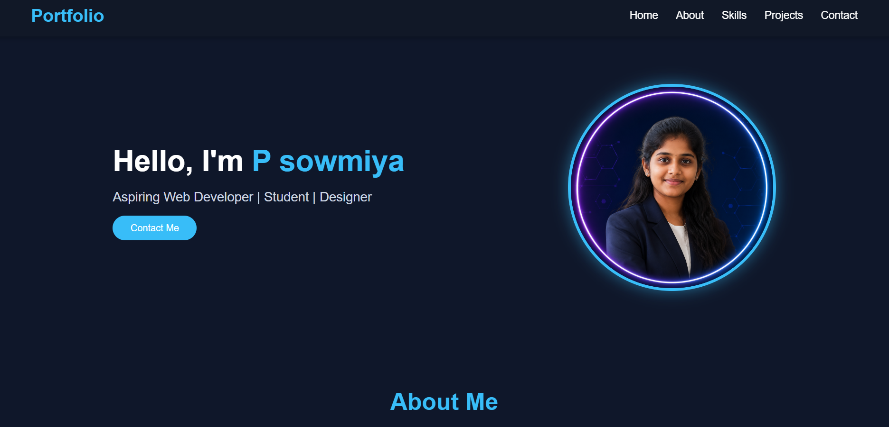
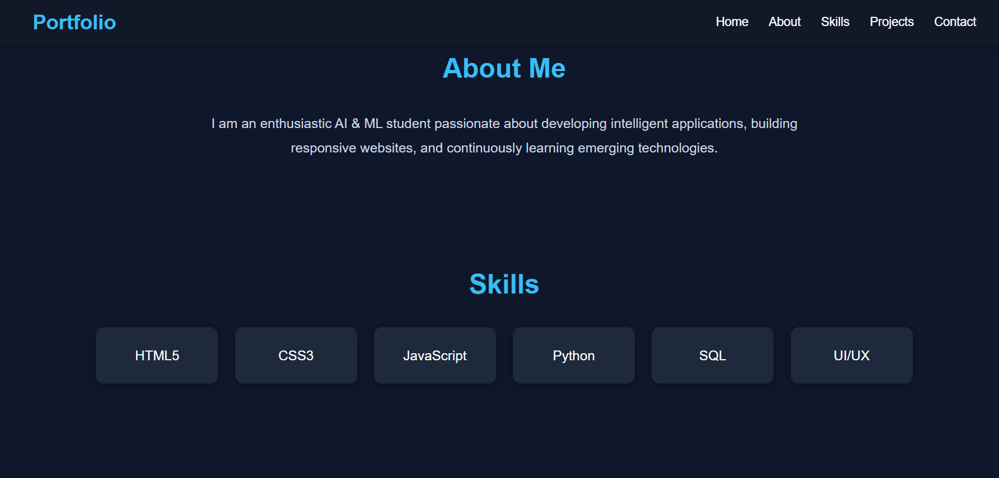
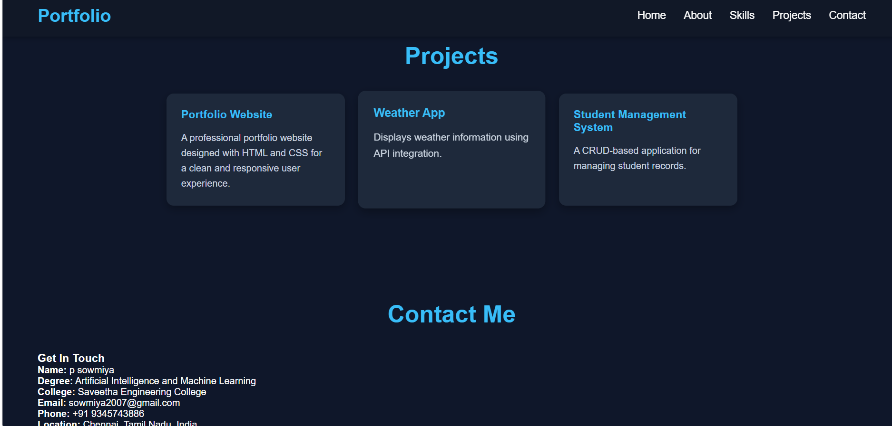

# Portfolio Website

## Aim
To design and develop a responsive personal portfolio website using HTML and CSS. The website showcases personal information, skills, projects, and contact details with a clean and professional user interface.

---

## Tools Used
- HTML5
- CSS3
- Visual Studio Code
- Git
- GitHub
- Google Chrome

---

## Algorithm

1. Create the HTML structure for the portfolio website.
2. Design the layout using CSS for styling and responsiveness.
3. Add a navigation bar for easy navigation.
4. Create a Hero section with profile image and introduction.
5. Add an About section describing personal details.
6. Create a Skills section to display technical skills.
7. Add a Projects section to showcase completed projects.
8. Include a Contact section and Footer with Name and Register Number.
9. Test the website in a browser.
10. Upload the project to GitHub.

---

## Features

- Responsive Navigation Bar
- Hero Section
- About Me
- Skills Section
- Projects Section
- Contact Form
- Responsive Design
- Modern User Interface

---

## Output

### Portfolio Website Screenshot

---

## Result

The portfolio website was successfully designed and developed using HTML and CSS. It provides a responsive, attractive, and user-friendly interface to showcase personal information, skills, projects, and contact details.

---

## Author

**Name:** Sowmiya

**Register Number:** 212225240152
